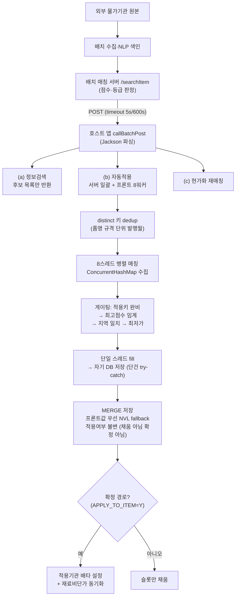

# 외부 물가정보 자동적용 · 유사도 기반 정보검색

> 여러 외부 물가정보 기관의 수집 데이터를 유사도 매칭해 건설 원가의 자재 단가를 자동으로 채우고, 검색·확정 정책을 계층적으로 분리한 기능.

## 배경 / 문제

건설 원가계산에서 자재 단가는 여러 외부 물가정보 기관(공공·시중 복수 기관)이 발행한 시세를 참고해 채워 넣는다. 이 시세는 별도 배치가 주기적으로 수집·색인(NLP 기반 정규화)해 두며, 원가 화면은 자재의 품명/규격/단위를 이 색인에 유사도 매칭해 후보 단가를 가져온다.

기존 구조에는 네 가지 문제가 있었다.

- **멀티 DB 오매핑**: 매칭 서버(`/mapItem`)가 자기 하드코딩 DB에 직접 결과를 기록했다. 호스트가 Oracle/PostgreSQL 등 서로 다른 datasource로 운영될 때 매칭 결과가 엉뚱한 DB에 써져 오매핑이 발생했다.
- **부가필드 소스 분산**: 분류/부가세/결제/인도조건/페이지 등 부가필드의 출처가 화면·경로마다 달랐다. 어떤 경로는 외부 시세 테이블을 다시 조인해 값을 보강하고, 어떤 경로는 배치 JSON을 그대로 썼다. 그 결과 같은 자재가 화면마다 다른 값을 보였다.
- **기준월 불일치**: 시세 조회 기준월의 소스 컬럼이 화면마다 달라(적용년월 vs 발주시기) 동일 자재의 결과가 화면 간에 어긋났다.
- **채움이 곧 확정**: 자동으로 채운 값이 곧바로 "확정 적용"으로 처리되어, 오매칭된 단가가 사용자 검토 없이 확정되는 위험이 있었다.

## 해결 접근

핵심은 네 가지다.

1. **Stateless 매칭 이관** — 배치 매칭 서버는 검색(`/searchItem`)만 담당하고, DB 쓰기는 호스트가 자기 datasource에만 수행하도록 분리했다. 매칭 서버의 고정 DB 직접 쓰기 경로를 폐기해 멀티 DB 오매핑을 제거했다.
2. **단일 진실원(SSOT)** — 부가필드의 소스를 배치 `/searchItem` 응답 JSON 하나로 통일했다. 호스트단에서 외부 시세 테이블을 다시 조인해 값을 보강하던 로직을 폐기하고, 값이 없으면 그냥 null로 둔다.
3. **채움 ≠ 확정** — 자동적용/검색적용/단가매핑은 기관별 슬롯 가격만 채우고 확정 플래그(적용여부)는 건드리지 않는다. 확정은 사용자의 라디오 선택 또는 최빈·최저 규칙으로만 발생한다. 이 정책을 저장 계층(SQL)에서 강제했다.
4. **인도조건 세그먼트 파생** — 원문은 여러 구분값(도매/소매 등)을 동그라미 마커(①~⑳)로 이어붙여 온다. 구분코드를 마커 인덱스로 삼아 해당 조각만 정규식으로 추출하고, 이를 공통코드로 파생한다.

성능은 자재별 배치 호출(건당 1~2.5초)을 distinct 키로 dedup한 뒤 `ExecutorService` 8스레드로 병렬화해 단축했다.

## 핵심 변경사항

| 영역 | 변경 내용 | 이유 |
|------|-----------|------|
| 매칭 서버 위임 (검색 진입점) | 품명/규격/단위 파싱 후 배치 `/searchItem`에 위임, 응답 JSON을 그대로 후보 목록으로 반환. 외부 시세 조인 보강 제거, 하위 등급 컷오프 제거(배치가 이미 필터), 선택적 하한 점수만 지원 | 부가필드 SSOT 통일, 호스트단 이중 필터로 정상 후보가 잘리던 문제 제거 |
| Stateless 자동매핑 | 자기 DB에서 대상 자재 읽기 → distinct 키로 8스레드 병렬 매칭 → 게이팅 → 자기 DB에 저장. 단건 try-catch로 한 건 실패가 전체 롤백을 유발하지 않음 | 매칭 서버 고정 DB 직접 쓰기 제거(멀티 DB 오매핑 해결), 순차 대비 처리시간 단축 |
| best 선정 게이팅 | 적용키 완비 후보만 → 최고 점수(임계 미달 시 미적용) → 동률 시 지역명 일치 우선 → 최저가. 점수는 0~100 클램프 | 신뢰도 게이팅 + 결정적 tie-break로 자동확정 위험 통제, 점수 오버플로 방지 |
| 인도조건 세그먼트 파생 | 원문에서 구분코드를 마커 인덱스로 삼아 ①~⑳ 뒤 세그먼트만 정규식 추출·공백 제거 → 공통코드 매칭. 조회키를 자원코드 앞16자리+최신 발행일로 교정 | 기관별 코드 형식 차이로 인도조건이 상시 NULL이던 버그 수정 |
| MERGE 저장 | 소스 서브쿼리를 공통코드 LEFT JOIN 시세테이블(항상 1행)로 바꾸고 `NVL(프론트값, 시세값)`로 배치 JSON 값 우선+fallback. 적용여부는 MATCHED에서 미설정, INSERT는 'N' | 엑셀 등 시세테이블에 없는 데이터소스도 저장, "채움≠확정"을 저장 계층에서 강제 |
| 기준월 통일 + 프론트 병렬 | 기준월 소스를 적용년월 단일로 통일(발주시기 제거). 프론트 자동적용도 8워커 concurrency 풀로 병렬화. JS 세그먼트 분해 로직이 SQL 파생과 동형 | 화면 간 기준월 불일치 제거, 대량 처리 단축, 옵션별 정확한 행 분리 |

## 사용 기술

- **Stateless 매칭 이관** — 검색(배치)과 쓰기(호스트 자기 DB) 분리로 멀티 DB 오매핑 제거
- **단일 진실원(SSOT) 정규화** — 부가필드 소스를 배치 JSON으로 통일, 조인 보강 폐기
- **`ExecutorService` 고정 8스레드 풀** + distinct 키 dedup + `ConcurrentHashMap` 수집 후 단일스레드 fill
- **신뢰도 게이팅 + 결정적 tie-break** (점수 → 지역 일치 → 최저가)
- **점수 정규화 클램프(0~100)** 로 `NUMBER(5,2)` 오버플로 방지
- **Oracle REGEXP + `UNISTR` 유니코드 마커(①~⑳) 세그먼트 파싱** — 인덱스 기반 세그먼트 선택
- **`MERGE` + `NVL` 프론트값 우선 / fallback** 으로 이종 데이터소스 저장 호환
- **"채움 ≠ 확정" 정책의 계층적 강제** (SQL에서 적용여부 불변, 확정은 별도 경로)
- **프론트-백엔드 동형 로직** (JS 세그먼트 분해 ↔ SQL 세그먼트 파생)으로 표시/저장 일관성
- **프론트 8워커 async concurrency 풀** (완료 콜백 재투입 드레이닝)

기술 스택: Java 17 / Spring MVC / MyBatis / Oracle · PostgreSQL / `HttpURLConnection` + Jackson / 순수 JS(async 풀)

## 처리 흐름

## 성과

- **멀티 DB 오매핑 제거** — 배치 서버 고정 DB 쓰기 경로 폐기, 호스트가 자기 datasource에만 기록.
- **처리시간 단축** — 배치 왕복(건당 1~2.5초)을 8스레드로 병렬화해, 수십 건 기준 순차 대비 처리시간을 대략 1/5~1/7 수준(수십 초 → 10초 안팎)으로 단축.
- **인도조건 파생 정상화** — 조회키를 자원코드 앞16자리+최신 발행으로 교정해, 기존 상시 NULL이던 인도조건 코드 저장을 정상화.
- **검색 노출 정합성 개선** — 호스트단 컷오프 제거로 배치의 등급 판정(저점수라도 자동후보)이 그대로 반영. 소수단가(유류 등) 빈칸 버그 수정.
- **오매칭 자동확정 방지** — 자동적용은 슬롯만 채우고 확정은 사용자 선택/최빈·최저로만 발생.
- **이종 데이터소스 저장 호환** — 엑셀 등 시세테이블에 없는 데이터소스도 MERGE가 배치 JSON 값 우선으로 저장.

## 대표 코드

- [01 · 배치 검색 위임 + JSON SSOT 후보 반환](snippets/01-stateless-search-delegation.md)
- [02 · distinct 키 dedup + 8스레드 병렬 매칭](snippets/02-parallel-batch-matching.md)
- [03 · best 게이팅 + 결정적 tie-break](snippets/03-best-gating-tiebreak.md)
- [04 · 인도조건 세그먼트 파생 (유니코드 마커 REGEXP)](snippets/04-delivery-segment-regexp.md)
- [05 · MERGE 프론트값 우선 저장 + 채움≠확정](snippets/05-merge-fill-not-confirm.md)

---

> 본 문서의 코드는 실제 운영 코드가 아니라, 적용한 기법을 일반화해 재현한 예시입니다.
