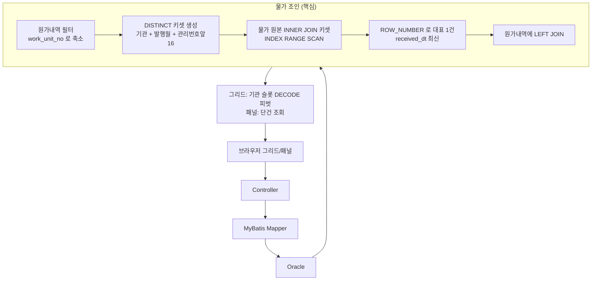

# 대용량 단가 조회 쿼리 / API 성능개선

> 대용량 시중 물가정보 테이블을 매 조회마다 FULL SCAN 하던 단가 조회를 세트 기반으로 재작성해 조회 응답을 수 초 → 1초 미만(약 20배)으로 개선하고, 대량 조회·엑셀 다운로드·집계 배치의 OOM 위험을 제거한 작업.

## 배경 / 문제

공공 물가정보와 시중단가를 수집·매핑해 건설 원가를 산출하는 시스템류에서는, 사용자가 등록한 원가내역(견적 단가)을 조사기관이 발행한 방대한 물가 원본 데이터에 조인해 품명·규격·페이지·인도조건 등을 채워 보여준다. 이때 다음 병목이 있었다.

1. **자재단가 그리드/패널 조회** — 원가내역(`cost_estimate_unit_price`)을 물가 원본(`market_price_data`, 수백만 행 규모)에 조인해 품명/규격/페이지 등을 채우는데, 조인키가 **물가 관리번호 문자열의 앞 16자리(`SUBSTR16`) 파생값**이라 색인이 없어 매 조회가 사실상 전 테이블 FULL SCAN → **조회당 수 초**.
2. **표준단가(자재·노무 등) 관리 화면** — 수만 행을 한 번에 로드하고, '직전 단가'를 행마다 스칼라 서브쿼리로 계산. 엑셀 다운로드는 전체 결과를 메모리에 List로 적재해 **OOM 위험**.
3. **자원수집 집계 배치 API** — 전량 메모리 적재 + 루프 내 행단위 스칼라 서브쿼리로 반복 풀스캔. 대량 건 누적 시 OOM.

## 해결 접근

병목을 **조인 · 메모리 · 행단위 계산** 세 축으로 분해해 각각 세트 기반으로 재작성했다.

- **조인**: 물가 원본을 직접 스캔하지 않고, 현재 화면이 실제 참조하는 소수의 키 집합만 먼저 만들어 밀어넣는 **키셋 세미조인 푸시다운**으로 전환. 조인키 3컬럼에 정확히 대응하는 복합 인덱스를 추가해 FULL SCAN → INDEX RANGE SCAN.
- **행단위 계산**: '직전 단가'를 행마다 상관 서브쿼리로 뽑던 것을 현재 페이지 키셋에만 한정한 별도 CTE에서 `SUBSTR(MAX(개정번호 || 값), N)` 그룹최대 기법으로 1회 계산.
- **메모리**: 대량 조회는 ROWNUM 이중중첩 페이징으로 한 페이지만 전송. 엑셀은 `SXSSFWorkbook`(디스크 flush) + MyBatis `ResultHandler` 커서 스트리밍으로 상수 메모리 처리. 배치는 스칼라 서브쿼리를 바인딩 파라미터로 치환하고 전량 적재를 페이지 단위 처리로 교체.

## 핵심 변경사항

| 영역 | 변경 내용 | 이유 |
|------|-----------|------|
| 물가 조인 (`getMaterialPriceList` / `getEstimateUnitPriceList`) | 물가 원본을 직접 조인하지 않고, 원가내역에서 만든 DISTINCT 키셋(기관 + 발행월 + 관리번호 앞16자리)을 INNER JOIN → `ROW_NUMBER()`로 대표 1건 추림 → 결과를 원가내역에 LEFT JOIN | 수백만 행 드라이빙 집합을 현재 화면이 실제 참조하는 소수 키로 축소해 인덱스가 닿는 범위만 스캔 |
| 복합 인덱스 `ix_price_data(institution_code, publish_ym, resource_code)` | 조인키 3컬럼(파생 `SUBSTR16` 값과 동일 도메인)에 정확히 맞춘 복합 인덱스 추가 | 실행계획 FULL SCAN → INDEX RANGE SCAN, 조회 응답 수 초 → 1초 미만 |
| 표준단가 페이징 조회 (`getResourcePriceListPage`) | ROWNUM 이중중첩 페이징 + 별도 CTE에서 직전단가/직전적용일 1회 계산 후 LEFT JOIN. 서비스는 페이지번호 → firstRownum/lastRownum 환산 | 전량 로드와 행단위 스칼라 서브쿼리 제거, 직전단가 계산 대상을 현재 페이지 키셋으로 한정 |
| 직전 단가 그룹최대 산출 | `SUBSTR(MAX(revision_no \|\| value), N)` — 개정번호를 정렬 접두로 붙인 뒤 최대값의 뒤쪽(값)만 잘라 '최신 개정의 값'을 윈도우함수 없이 획득 | 조인·정렬 비용이 큰 상관 서브쿼리/윈도우 없이 단일 GROUP BY로 최신값 획득 |
| 엑셀 스트리밍 | `SXSSFWorkbook`(100행만 메모리 유지·나머지 디스크 flush) + MyBatis `ResultHandler`(fetchSize=1000) 커서 스트리밍, 조회와 동시에 셀 기록 후 `dispose()`로 임시파일 정리 | 수만 행 엑셀을 상수 메모리로 생성, 전량 List 적재 OOM 제거 |
| 집계 배치 API | 행단위 스칼라 서브쿼리를 직전 INSERT와 동일값인 바인딩 파라미터로 치환, 전량 적재 업데이트를 페이지 단위로 교체 | 루프 내 반복 풀스캔 제거 + 대량 건 메모리 누적(OOM) 차단 |

## 사용 기술

- 키셋 세미조인 푸시다운 (대량 테이블을 소수 키셋으로 축소 후 조인)
- 복합 인덱스로 FULL SCAN → INDEX RANGE SCAN 전환 (함수 파생 `SUBSTR16` 조인키 정합)
- `ROW_NUMBER() OVER(PARTITION BY ... ORDER BY received_dt DESC NULLS LAST)` 대표 1건 dedup
- Oracle ROWNUM 이중중첩 페이징 (`FIRST_ROWS` 힌트, firstRownum/lastRownum)
- 페이지 한정 CTE + `SUBSTR(MAX(키 || 값), N)` 그룹최대 기법으로 상관 서브쿼리 제거
- `SXSSFWorkbook` + MyBatis `ResultHandler` 커서 스트리밍 (상수 메모리 엑셀)
- 스칼라 서브쿼리 → 바인딩 파라미터 치환 (동치 값 재사용)
- 전량 적재 → 페이지 단위 처리로 배치 OOM 방지
- 스택: Java 17, Spring Boot, MyBatis, Oracle, Apache POI (SXSSF)

## 처리 흐름

## 성과

- **자재단가 물가 조인: 조회 응답 수 초 → 1초 미만 (약 20배)**, 실행계획이 FULL SCAN → INDEX RANGE SCAN 으로 전환되며 비용 대폭 감소
- 물가 매칭 결과 동등성 유지하면서 성능만 개선 (동작 동등성 확인)
- 표준단가 대량 조회를 페이지 단위로 전환, '직전 단가'를 페이지 키셋 대상 1회 계산으로 축소
- 엑셀 다운로드를 100행 유지 스트리밍으로 전환 → 행 수와 무관하게 상수 메모리, OOM 제거
- 집계 배치 API: 루프 내 반복 풀스캔 제거 + 대량 건 메모리 누적 위험 차단

## 대표 코드

- [01. 물가 조인 키셋 세미조인 푸시다운 + 대표 1건 dedup](snippets/01-keyset-semijoin-pushdown.md)
- [02. Oracle ROWNUM 이중중첩 페이징 공통 프래그먼트](snippets/02-rownum-nested-paging.md)
- [03. 직전 단가: 상관 서브쿼리 없는 그룹최대 + 페이지 한정](snippets/03-group-max-previous-price.md)
- [04. SXSSFWorkbook + MyBatis ResultHandler 엑셀 스트리밍](snippets/04-excel-streaming-sxssf.md)
- [05. 집계 배치: 스칼라 서브쿼리 → 바인딩 치환 + 페이지 업데이트](snippets/05-batch-binding-substitution.md)

---

> 본 문서의 코드는 실제 운영 코드가 아니라, 적용한 기법을 일반화해 재현한 예시입니다.
